# Module 14 - Automation with Python

This repository contains a demo project created as part of my **DevOps studies** in the [TechWorld with Nana – DevOps Bootcamp](https://www.techworld-with-nana.com/devops-bootcamp).

**Demo Project:** Website Monitoring and Recovery

**Technologies used:** Python, DigitalOcean, Docker, Linux

**Project Description:**

- Create a server on a cloud platform
- Install Docker and run a Docker container on the remote server
- Write a Python script that monitors the website by accessing it and validating the HTTP response
- Write a Python script that sends an email notification when website is down
- Write a Python script that automatically restarts the application & server when the application is down

---

## Prerequisites

- [Python 3.14+](https://www.python.org/downloads/) and [uv](https://docs.astral.sh/uv/) for dependency management
- A [DigitalOcean](https://www.digitalocean.com/) account with permission to create droplets and generate API tokens
- A [Resend](https://resend.com/) account for sending email notifications over SMTP
- An SSH key pair on your machine — the public key is added to the droplet, and the private key lets the script reconnect to restart the container

The script relies on the following Python libraries (installed automatically by `uv sync`):

| Library | Purpose |
| --- | --- |
| [`requests`](https://requests.readthedocs.io/) | Send the HTTP health-check request to the website |
| [`python-dotenv`](https://pypi.org/project/python-dotenv/) | Load configuration from the `.env` file |
| [`paramiko`](https://www.paramiko.org/) | Open an SSH session to the droplet and restart the container |
| [`pydo`](https://pydo.readthedocs.io/) | DigitalOcean API client used to reboot the droplet |
| [`schedule`](https://schedule.readthedocs.io/) | Run the monitoring check on a recurring interval |

Install the dependencies:

```shell
uv sync
```

### Configure environment variables

Copy the example file and fill in your own values:

```shell
cp .env.example .env
```

| Variable | Description |
| --- | --- |
| `DROPLET_IP` | Public IP address of the droplet being monitored |
| `DROPLET_ID` | Numeric droplet ID, used by the DigitalOcean API to trigger a reboot |
| `DO_API_TOKEN` | DigitalOcean **read/write** API token |
| `SMTP_USER` | Resend SMTP username (`resend`) |
| `SMTP_PASSWORD` | Resend API key |
| `SSH_PRIVATE_KEY_PATH` | Absolute path to the private SSH key that connects to the droplet |

---

### Overview

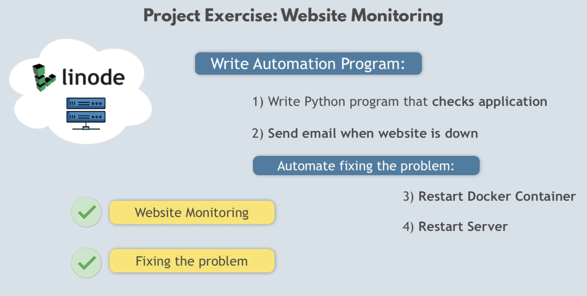

The monitor periodically requests the website and reacts to failures in two tiers:

- **Application down** (the site returns a non-`200` status): email an alert and restart the Docker container over SSH.
- **Server unreachable** (the request fails entirely): email an alert, reboot the whole droplet via the DigitalOcean API, wait for it to come back online, then restart the container.

### 1. Create a droplet on DigitalOcean

- **RAM:** 2 GB
- Assign the public SSH key from your computer so you can connect without a password.

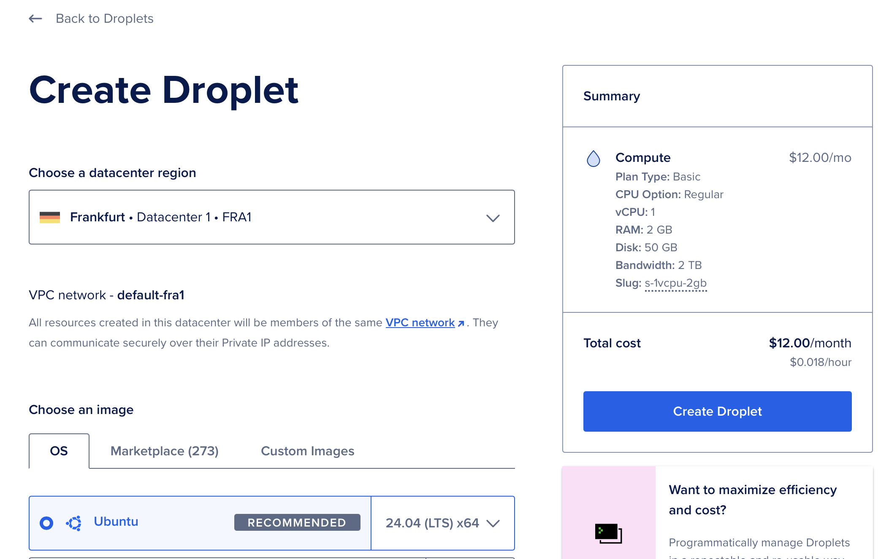

Connect to the droplet:

```sh
ssh root@<DROPLET-IP>
```

Check the OS:

```sh
cat /etc/os-release
```

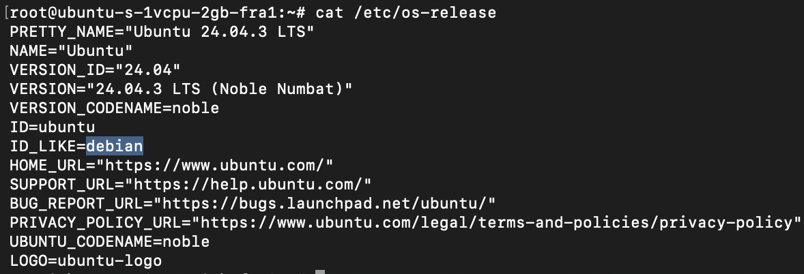

### 2. Install Docker and run a container on the remote server

Install Docker by following the official guide for Ubuntu:
https://docs.docker.com/engine/install/ubuntu

Run the `nginx` image, mapping container port `80` to host port `8080`:

```sh
docker run -d -p 8080:80 nginx
```

Open `http://<DROPLET-IP>:8080` in your browser to confirm it is serving:

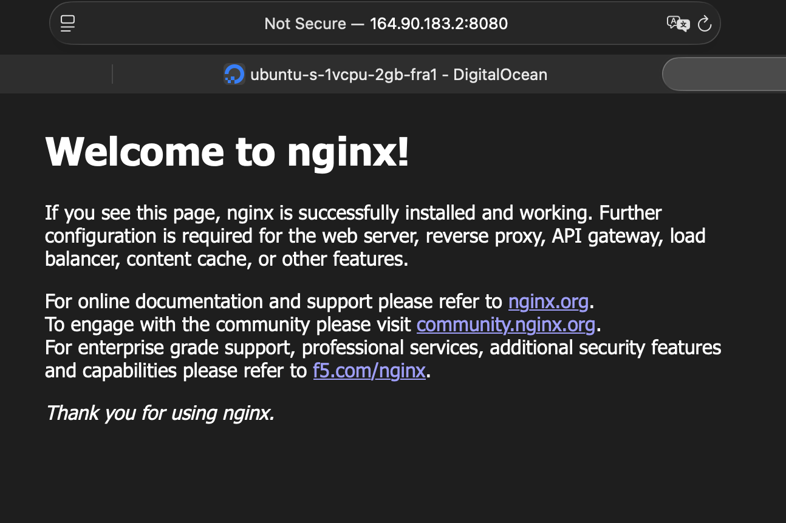

### 3. Monitor the website with an HTTP health check

Send a request to the site and validate the response status code:

```py
import os
import requests
from dotenv import load_dotenv

load_dotenv()

droplet_ip = os.getenv('DROPLET_IP')
response = requests.get(f"http://{droplet_ip}:8080")

if response.status_code == 200:
  print('Application is running successfully!')
else:
  print('Application Down. Fix it!')
```

Run it:

```sh
python3 monitor-website.py
```

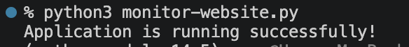

### 4. Send an email notification when the site is down

Create a [Resend](https://resend.com/) account, then grab your SMTP credentials and an API key:

- https://resend.com/settings/smtp
- https://resend.com/api-keys

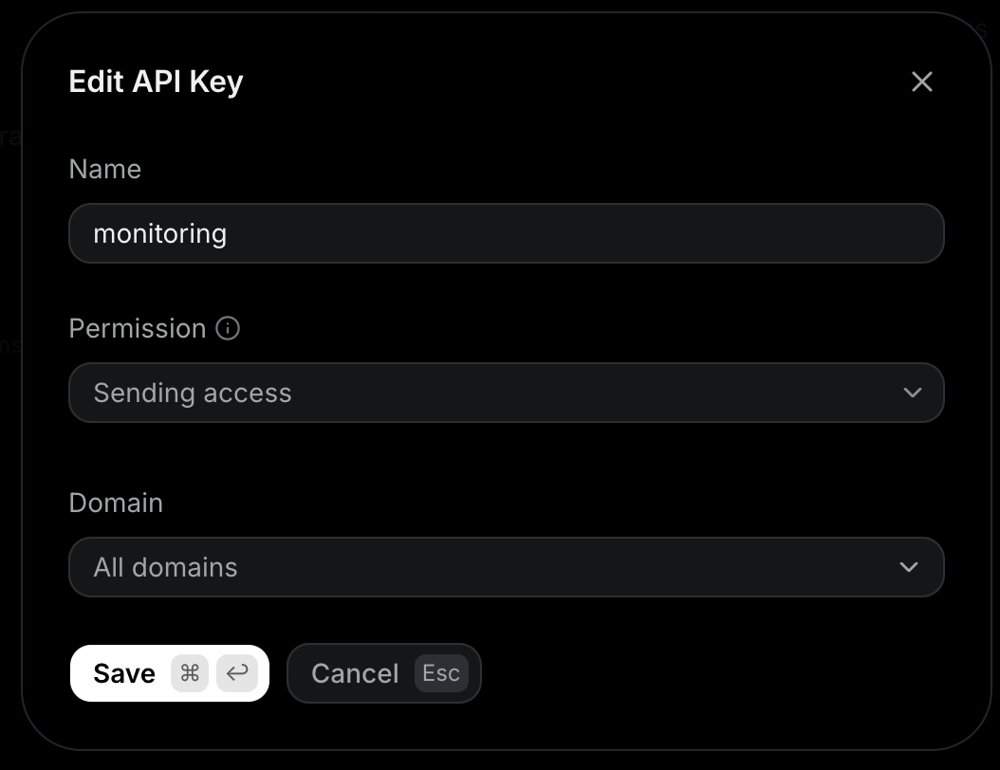

Set the SMTP credentials in `.env`:

```conf
SMTP_USER=resend
SMTP_PASSWORD=YOUR_API_KEY
```

Send an email through Resend's SMTP server whenever the check fails:

```python
import os
import requests
import smtplib
from dotenv import load_dotenv

load_dotenv()

DROPLET_IP = os.getenv('DROPLET_IP')
SMTP_USER = os.getenv('SMTP_USER')
SMTP_PASSWORD = os.getenv('SMTP_PASSWORD')
EMAIL_FROM = 'onboarding@resend.dev'
EMAIL_TO = EMAIL_FROM
response = requests.get(f"http://{DROPLET_IP}:8080")

with smtplib.SMTP('smtp.resend.com', 587) as smtp:
  smtp.starttls()
  smtp.ehlo()
  smtp.login(SMTP_USER, SMTP_PASSWORD)
  msg = f"From: {EMAIL_FROM}\nTo: {EMAIL_TO}\nSubject: SITE DOWN\n\nFix the issue! Restart the application."
  smtp.sendmail(EMAIL_FROM, EMAIL_TO, msg)
```

Run the script and check the Resend dashboard to confirm the email was delivered:

```sh
python3 monitor-website.py
```

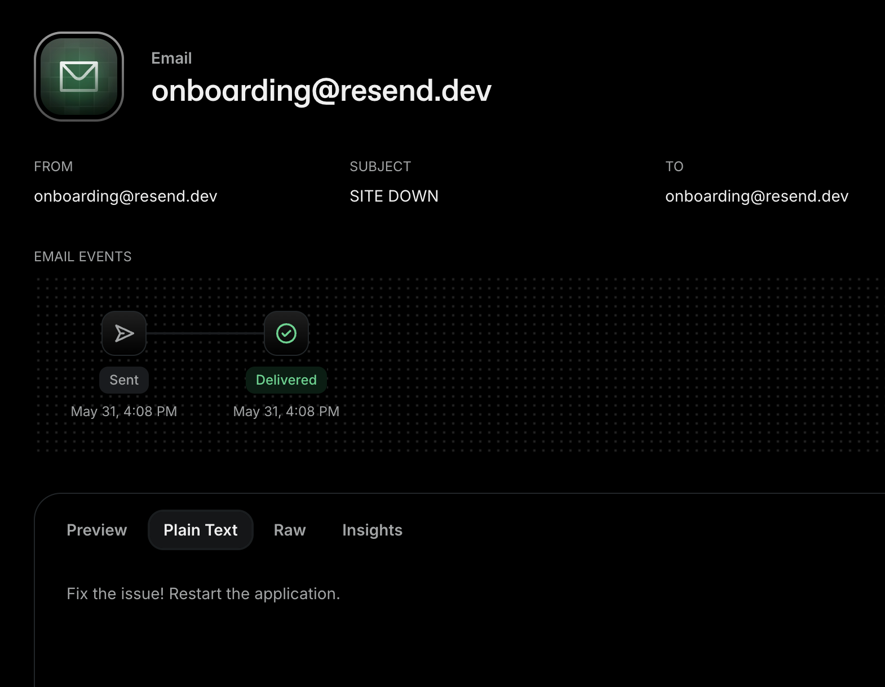

To simulate an outage, stop the `nginx` container on the droplet:

```sh
docker ps
docker stop <NGINX-CONTAINER-ID>
```

#### Handle connection errors

A stopped container makes the site unreachable, so `requests.get` raises an exception instead of returning a status code. Wrap the check in `try/except` and move the email logic into a reusable `send_notification` function:

```py
import os
import requests
import smtplib
from dotenv import load_dotenv

load_dotenv()

DROPLET_IP = os.getenv('DROPLET_IP')
SMTP_USER = os.getenv('SMTP_USER')
SMTP_PASSWORD = os.getenv('SMTP_PASSWORD')
EMAIL_FROM = 'onboarding@resend.dev'
EMAIL_TO = EMAIL_FROM

def send_notification(email_msg):
  with smtplib.SMTP('smtp.resend.com', 587) as smtp:
      smtp.starttls()
      smtp.ehlo()
      smtp.login(SMTP_USER, SMTP_PASSWORD)
      message = f"From: {EMAIL_FROM}\nTo: {EMAIL_TO}\nSubject: SITE DOWN\n\n {email_msg}"
      smtp.sendmail(EMAIL_FROM, EMAIL_TO, message)

try:
  response = requests.get(f"http://{DROPLET_IP}:8080")
  if response.status_code == 200:
    print('Application is running successfully!')
  else:
    print('Application Down. Fix it!')
    msg = f"Application returned {response.status_code}."
    send_notification(msg)
except Exception as ex:
  print(f"Connection error happened: {ex}")
  msg = f"Application not accessible at all."
  send_notification(msg)
```

Run again — this time the request fails outright, and you receive the "not accessible" email:

```sh
python3 monitor-website.py
```

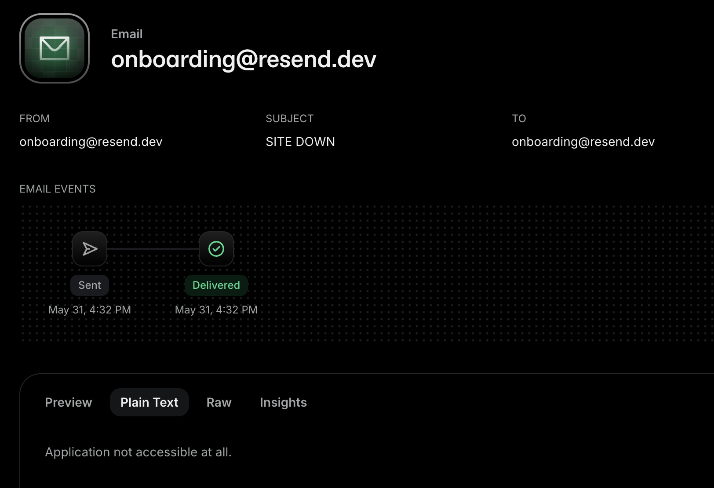

### 5. Automatically restart the application and server

Now react to failures instead of only reporting them.

Add the absolute path of your private SSH key to `SSH_PRIVATE_KEY_PATH` in `.env`, then verify the script can open an SSH session to the droplet:

```py
ssh = paramiko.SSHClient()
ssh.set_missing_host_key_policy(paramiko.AutoAddPolicy())
ssh.connect(hostname=DROPLET_IP, username='root', key_filename=SSH_PRIVATE_KEY_PATH)
stdin, stdout, stderr = ssh.exec_command('docker ps')
print(stdout.readlines())
ssh.close()
```

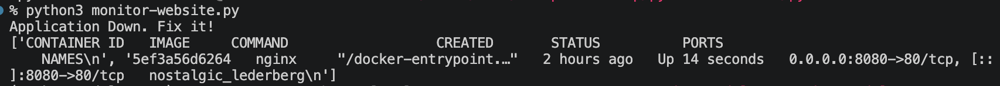

With SSH working, the script can find the stopped `nginx` container and start it again — see `restart_container()` in the [final code](./monitor-website.py).

#### Reboot the droplet when it is completely unreachable

If the server itself is down, SSH cannot connect either — so reboot the whole droplet through the DigitalOcean API.

Create a **read/write** API token:
https://cloud.digitalocean.com/account/api/tokens/new

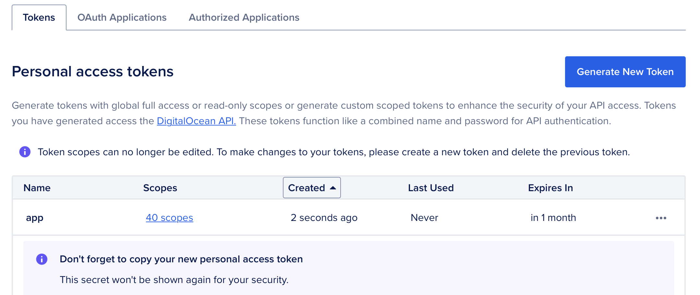

Set the token as `DO_API_TOKEN` in `.env`.

Find your droplet ID — open the droplet in the DigitalOcean dashboard and read the number from the URL:

```
https://cloud.digitalocean.com/droplets/123456789
                                        ^^^^^^^^^
```

Set that number as `DROPLET_ID` in `.env`.

Trigger a reboot with `pydo`:

```py
client = pydo.Client(token=DO_API_TOKEN)
client.droplet_actions.post(DROPLET_ID, body={'type': 'reboot'})
```

The final script goes a step further: it polls the reboot action until it completes, waits for the droplet status to become `active` again, and only then restarts the container — see `restart_server_and_container()` in the [final code](./monitor-website.py).

To test it, stop the container (or power off the droplet) and run the script:

```sh
docker ps
docker stop <NGINX-CONTAINER-ID>
```

Watch the reboot appear on your droplet dashboard:

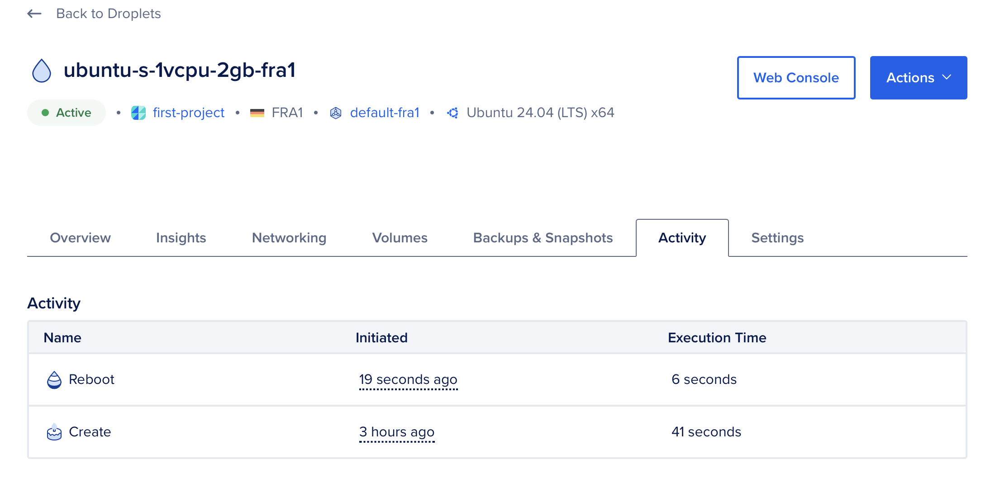

### 6. Run the check on a schedule

Finally, tie everything together by running the monitor every 5 minutes in a loop:

```py
import schedule
import time

schedule.every(5).minutes.do(monitor_application)

while True:
  schedule.run_pending()
  time.sleep(1)
```

Start the monitor:

```sh
python3 monitor-website.py
```

See the complete script: [monitor-website.py](./monitor-website.py)

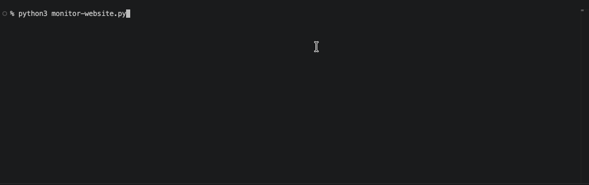

### Remove created droplet on DigitalOcean
